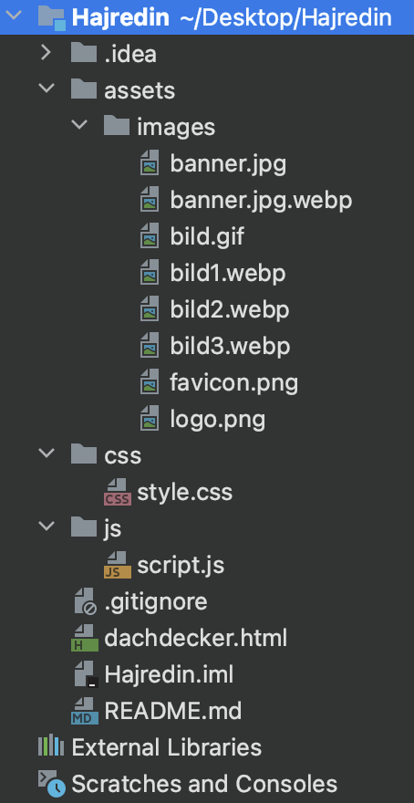
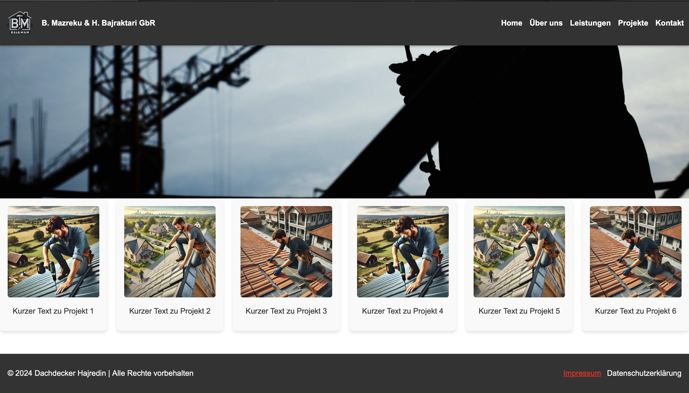

🏠 **Dachdecker Project**

Welcome to the **Dachdecker** project! 🚀
This is a custom website designed for a roofing company: B. Mazreku & H. Bajraktari GbR.

📋 **Project Overview**

This website showcases:

✅ Services offered by the company
✅ Completed projects with images 📸
✅ Contact information and legal details 📞

---

## **🛠️ Tech Stack**
The project is built using the following technologies:

HTML5 🌐
CSS3 🎨
JavaScript ⚙️

---

## 📁 **Project Structure**

Here is a visual overview of the project structure:  

---

## ✨ **Features**

📷 Project Gallery: A carousel-like display of past projects
📄 About Us Section: Information about the company and services
📞 Contact Section: Easy access to the company's contact details
🎨 Responsive Design: Looks great on both desktop and mobile devices

---

## 🚀 **How to Run**

Clone this repository to your local machine:
git clone https://github.com/Altonbekolli/Dachdecker.git

---

## 🖼️ **Screenshots**

**Home Page**  
Here is a preview of the homepage:  

---

## 💬 **Contact Information**

For any inquiries, please contact:

📧 Email: Altonbekolli_1@web.de
🌐 Website: Coming soon!
